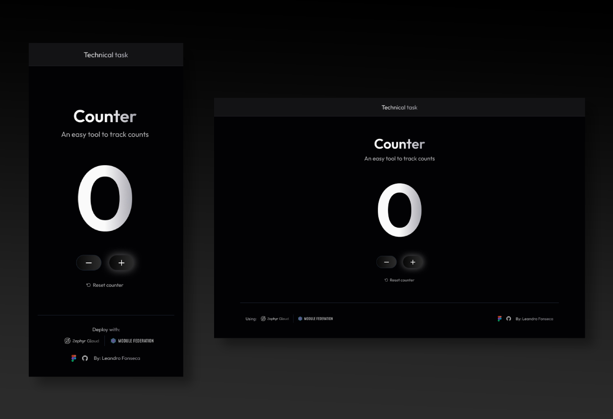

# Technical Task

This App is a counter that was created during a Technical task.

<p align="left">
  
</p>


## Layout

I developed the application's Layout in Figma. And then I used the Layout as a reference to create the code.

<a href="https://www.figma.com/design/ffcS9ZL5vOtn8o3vxCDTbZ/Untitled?node-id=905-2&t=5GrSG6CFvw9hDbQG-1" target="_blank">Click here to see the Layout in Figma</a>


## Deploy

I deployed the application using Zephyr cloud.

<a href="https://leandro-fonseca-1307-host-technicaltaskvalor-lean-12b2a67b6-ze.zephyrcloud.app/" target="_blank">Click here to see the deployed result.</a>


## Project base

To create this project I used the example available in the zephyr-examples repository as a base.

<a href="https://github.com/ZephyrCloudIO/zephyr-examples/tree/main/examples/turbo-rspack-mf" target="_blank">Click here to see the repository used as a base</a>


## Installation:

To run the project locally, follow the steps below:

### 1. Prerequisites:

Before you begin, make sure you have installed:

- <a href="https://nodejs.org/en" target="_blank">Node.js</a>

- <a href="https://pnpm.io/" target="_blank">pnpm</a>

### 2. Clone the repository:

```sh
git clone https://github.com/leandrofc/technicalTaskValor.git
```

### 3. Access the project directory:

```sh
cd technicalTaskValor
```

### 4. Install the dependencies::

```sh
pnpm install
```

### 5. Running the project:

```sh
pnpm run dev
```

### 5. The project will be running at:

http://localhost:3001/

